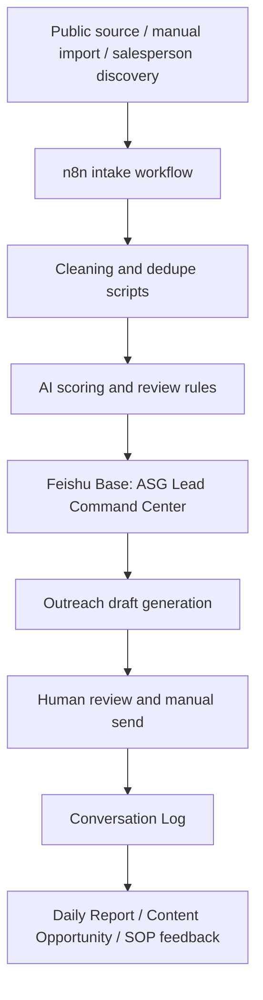

# System Architecture

ASG Lead Command Center uses Feishu Base as the business control surface and n8n as the scheduler. Local scripts handle cleaning, dedupe, Feishu API access, scoring validation, draft creation, and reporting.

## Boundaries

- AI can recommend, score, summarize, draft, and report.
- Salespeople approve, edit, send, quote, and close.
- Feishu is the source of operational truth.
- Local files are project assets and test fixtures.
- No external platform action is automated in V1.

## Runtime Components

| Component | Role |
|---|---|
| `scripts/feishu_client.py` | Read and write Feishu Base records through environment-configured credentials. |
| `scripts/clean_leads.py` | Normalize lead rows before writing to Lead Pool. |
| `scripts/dedupe_leads.py` | Detect exact and likely duplicates. |
| `scripts/score_leads.py` | Validate scoring JSON and map score to priority. |
| `scripts/generate_outreach.py` | Build review-only outreach task payloads. |
| `scripts/generate_daily_report.py` | Summarize daily metrics into boss-readable markdown. |
| `n8n-workflows/` | Workflow skeletons for import and later wiring. |

